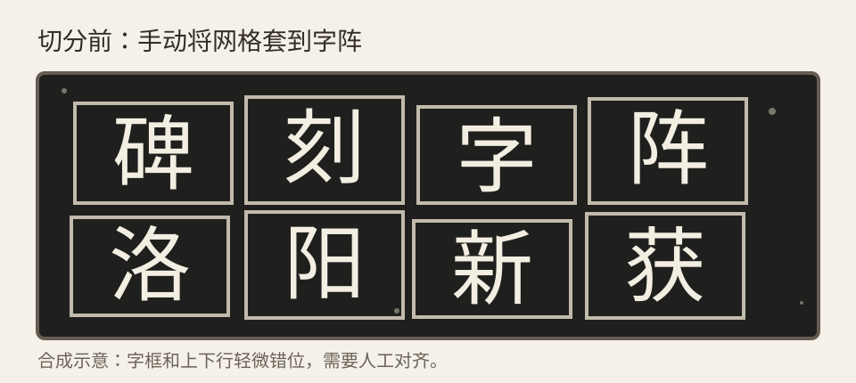
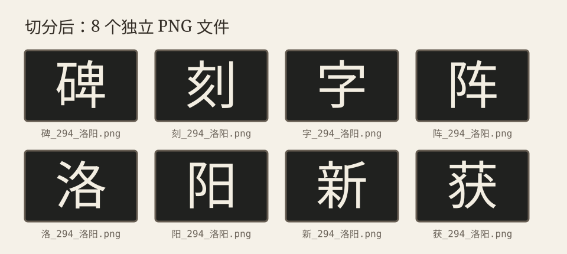

# 碑刻字阵切分

一个完全离线的碑刻字阵人工切分工具。无需安装或构建，不会上传图片。

## 效果示例

| 切分前 | 切分后 |
| --- | --- |
|  |  |

以上为合成示意；实际导出结果是每个字各自独立的 PNG 文件。

## 使用

在 Chrome 或 Edge 中双击直接打开 `index.html`（`file://` 即可）。可通过文件选择、拖进画布或在页面内粘贴 PNG/JPEG/WebP 导入已裁好的规则字阵；之后设置行列、旋转图片、手工对齐网格，填入字头后选择目录导出 PNG 与 `manifest.csv`。

网格对齐直接在画布完成：拖四角缩放、拖外边框移动、拖内部线调整整条分割线；按 Alt/Option 拖内部线可只调整鼠标所在段。黄色高亮表示当前命中。滚轮与“适应窗口”只改变查看大小，不改变网格或导出结果。

目录导出使用 File System Access API，目前以 Chrome 和 Edge 为目标浏览器。导出前须填写书名简称和页码。

书名、书名简称与页码会保存于当前浏览器的本地存储，并在换图或刷新后恢复；说明和字头不会保存。清除浏览器该站点的数据即可移除这些默认值。

## 自检

```sh
node test_core.cjs
node --check core.js
node --check app.js
```

## License

[MIT](LICENSE)
