# 碑刻字阵切分

一个完全离线的碑刻字阵人工切分工具。无需安装或构建，不会上传图片。

## 效果示例

《北朝墓志全编补编》第 57 页，4×3 字阵：

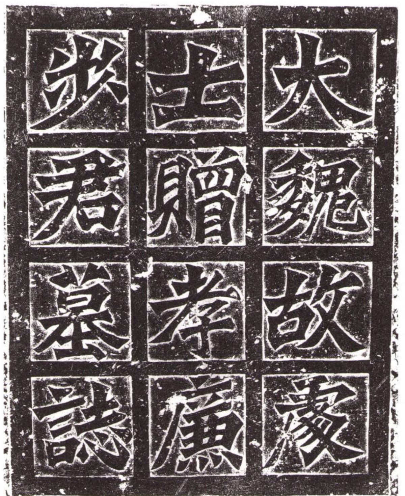

切分后，每个字分别导出为独立 PNG：

| 步 | 士 | 大 |
| --- | --- | --- |
|  | 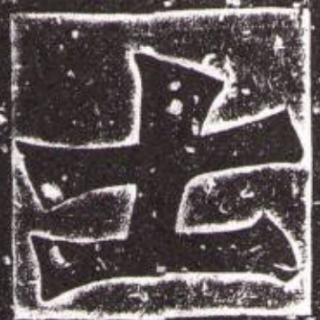 | 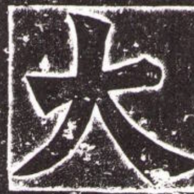 |
| 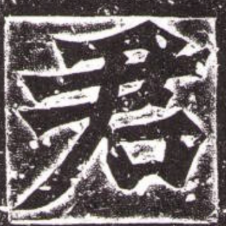 | 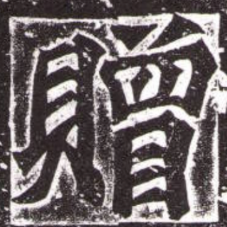 | 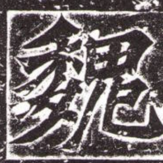 |
| 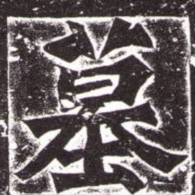 | 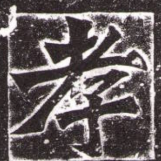 |  |
| 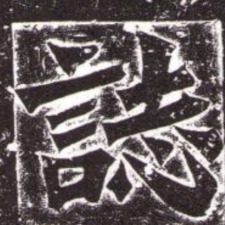 | 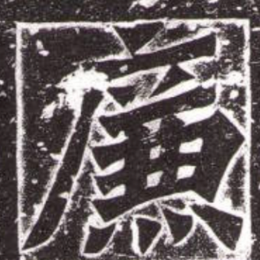 | 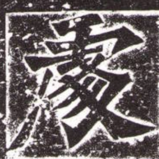 |

示例文件名采用默认格式，如 `大_57_北朝墓志全编补编.png`。

## 使用

在 Chrome 或 Edge 中双击直接打开 `index.html`（`file://` 即可）。可通过文件选择、拖进画布或在页面内粘贴 PNG/JPEG/WebP 导入已裁好的规则字阵；之后设置行列、旋转图片、手工对齐网格，填入字头后选择目录导出 PNG 与 `manifest.csv`。固定尺寸默认导出 `original,300`；300×300 等固定尺寸可补透明、米黄、黑、白或自定义颜色，`original` 始终保持原始裁切尺寸。

网格对齐直接在画布完成：拖四角缩放、拖外边框移动、拖内部线调整整条分割线；按 Alt/Option 拖内部线可只调整鼠标所在段。黄色高亮表示当前命中。滚轮与“适应窗口”只改变查看大小，不改变网格或导出结果。

目录导出使用 File System Access API，目前以 Chrome 和 Edge 为目标浏览器。导出前须填写书名简称和页码。

书名、书名简称与页码会保存于当前浏览器的本地存储，并在换图或刷新后恢复；说明和字头不会保存。清除浏览器该站点的数据即可移除这些默认值。

## 自检

```sh
node test_core.cjs
node --check core.js
node --check app.js
```

## License

[MIT](LICENSE)
